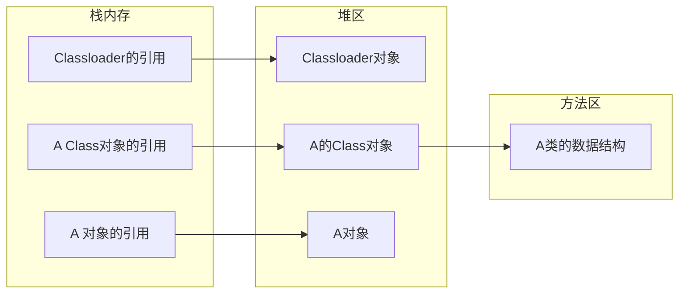

# Java高并发编程

## 第一章 多线程基础

### 1. 快速认识线程

```java
public class TryConcurrency {
    public static void main(String[] args){
        //静态方法的引用，简化了lambda表达式的语法，返回一个函数式接口Runnable
        new Thread(TryConcurrency::enjoyMusic).start();
        browseNews();
    }
    private static void browseNews(){
        for (; ; ) {
            System.out.println("Uh-huh,the good news.");
            try {
                TimeUnit.SECONDS.sleep(1);
            } catch (InterruptedException e) {
                e.printStackTrace();
            }
        }
    }
    private static void enjoyMusic() {
        for (; ; ) {
            System.out.println("Uh-huh,the nice music.");
            try {
                TimeUnit.SECONDS.sleep(1);
            } catch (InterruptedException e) {
                e.printStackTrace();
            }
        }
    }
}
//output:
Uh-huh,the good news.
Uh-huh,the nice music.
Uh-huh,the good news.
Uh-huh,the nice music.
    ...
```

### 2. 线程的生命周期

1. 线程的生命周期可以分为5个阶段
    - new状态：当我们用关键字new创建一个Thread对象时，此时它并不处于执行状态，因为没有调用start方法启动该线程，那么线程的状态为NEW状态。
    - Runnable状态：线程对象进入Runnable状态必须调用start方法，此时才是真正的在JVM中创建了一个线程，Runnable的线程只能意外终止或者进入Running状态。
    - Running状态：一旦CPU通过轮询或者其他方法从任务可执行队列中选中了线程，那么此时它才能真正的执行自己的逻辑代码，一个正在Running状态的线程事实上也是Runnable的，反过来不成立。
        - 在该状态中，线程的状态可以发生如下的状态转换：
            1. 直接进入Terminated状态，比如调用JDK已经不推荐使用的stop方法或者判断某个逻辑标识。
            2. 进入Blocked状态，比如调用了Sleep，获取Wait方法而加入了WaitSet中
            3. 进行某个阻塞的IO操作，比如因网络数据的读写而进入了Blocked状态
            4. 获取某个锁资源，从而加入到该锁的阻塞队列中而进入了Blocked状态
            5. 由于CPU的调度器轮询使该线程放弃执行，进入了Runnable状态
            6. 线程主动调用yield方法，放弃CPU执行权，进入Runnable状态
    - Blocked状态
        - 在该状态中，线程的状态可以发生如下的状态转换：
            1. 直接进入Terminated状态，比如调用JDK已经不推荐使用的stop方法或者意外死亡
            2. 线程阻塞的操作结束，比如读取了想要的数据字节进入到Runnable状态
            3. 线程完成了指定时间的休眠，进入到了Runnable状态
            4. Wait中的线程被其他线程notify/notifyall唤醒，进入Runnable状态
            5. 线程获取到了某个锁资源，进入Runnable状态
            6. 线程在阻塞的过程中被打断，比如其他的线程调用了interrupt方法，进入了Runnable状态
    - Terminated状态
        - 下列这些情况会使线程进入Terminated状态
            1. 线程运行正常结束，结束生命周期
            2. 线程运行出错意外结束
            3. JVM Crash，导致所有的线程都结束

## 第三章 Thread API 介绍

### 3.7 线程interrupt

- 线程内部存在着名为interrupt flag的标识，如果一个线程被interrupt，那么它的flag将被设置，但是如果当前线程正在执行可中断方法被阻塞时，调用interrupt方法将其中断，会导致flag被清除。如果一个线程已经是死亡状态，那么尝试对其的interrupt会直接被忽略。

## 第四章 程序的死锁

### 4.1 程序死锁的原因以及诊断

1. 交叉锁可导致程序出现死锁
2. 内存不足
3. 一问一答式的数据交换
4. 数据库锁
5. 文件锁
6. 死循环引起的死锁

#### 4.1.1 程序死锁举例

1. HashMap不具备线程安全的能力，如果想要使用线程安全的map结构请使用ConcurrenthashMap或者使用Collections.synchronizedMap来代替

#### 4.1.2 死锁诊断

## 第五章 线程间通信

### 5.1 同步阻塞与异步非阻塞消息处理机制

- 同步阻塞：客户端提交一个Event给服务端，并且等待服务器响应之后获取响应结果
    - 客户端等待时间过长
    - 系统整体的吞吐量不高
    - 会导致出现频繁的创建开启与销毁线程，增加系统额外开销
    - 大量业务处理线程阻塞会导致频繁的CPU上下文切换，降低系统性能
- 异步非阻塞
    - 提高了系统的吞吐量和并发量
    - 需要再次调用查询接口进行查询，可以采用异步回调接口的方法来实现这个问题

### 5.2 单线程间通信

#### 5.2.1 初识wait和notify

1. wait()和notify()必须首先获取同步锁
2. wait()是指一个已经进入了同步锁的线程内，让自己暂时让出同步锁，以便其他正在等待此锁的线程可以得到同步锁并运行，只有其他线程调用了notify方法(notify并不释放锁，只是告诉调用过wait方法的线程可以去参与获得锁的竞争，但不是马上得到锁，因为锁还在别人手里，别人还没有释放)，调用wait方法的一个或者多个线程就会解除wait状态，重新参与竞争对象锁。

- wait方法调用的都是wait(long timeout)这个方法，wait(0)表示永不超时
- object的wait方法会导致当前线程进入阻塞，直到有其他线程调用了object的notify或者notifyAll才能将其唤醒，或者阻塞时间到达了timeout时间而自动唤醒
- wait方法必须拥有该对象的monitor，也就说wait方法必须在同步方法中使用
- 当前线程执行了该对象的wait方法后，将会放弃对该monitor的所有权并且进入与该对象关联的wait set中，也就是说，一旦线程执行了某个object的wait方法之后，它就会释放对该对象monitor的所有权，其他线程也会有机会继续争抢该monitor的所有权
- notify方法
    - 唤醒单个正在执行该对象wait方法的线程
    - 如果有某个线程由于执行该对象的wait方法而进入阻塞则会被唤醒，如果没有则会忽略。
    - 被唤醒的线程需要重新获取对该对象所关联的monitor的lock才能继续执行。

- 关于wait和notify的注意事项
    - wait方法是可中断方法
    - 每一个对象的monitor都有一个与之关联的wait set，线程执行了某个对象的wait方法后，会加入该对象的wait set中
    - 当线程进入wait set之后，notify方法可以将其唤醒
    - 必须在同步方法中使用wait和notify，因为执行wait和notify的前提条件是必须持有同步方法的monitor的所有权
    - 同步代码的monitor必须与执行wait和notify方法的对象一致
- wait和sleep
    - wait和sleep都可以使线程进入阻塞状态
    - wait和sleep方法均是可中断方法，被中断后都会收到中断异常
    - wait是object的方法，sleep是Thread特有的方法
    - wait方法的执行必须在同步方法中进行，sleep则不需要
    - 线程在同步方法中执行sleep方法时，并不会释放monitor锁，而wait方法则会释放
    - sleep方法短暂休眠之后会主动退出阻塞，而wait方法则需要被其他线程中断后才能退出阻塞

### 5.3 多线程间通信

#### 5.3.1 生产者和消费者

1. notifyAll方法：和notify方法类似都可以唤醒由于调用了wait方法而阻塞的线程，但是notify方法只能唤醒其中一个线程，而notifyAll方法则可以同时唤醒全部的阻塞线程，同样被唤醒的线程仍需要继续争抢monitor的锁
2. 生产者和消费者
    1. LinkedList为空时执行removeFirst方法
    2. LinkedList元素为10时执行addLast方法
3. 线程休息室wait set：线程调用了某个对象的wait方法之后都会被加入与该对象monitor关联的wait set中，并且释放monitor的所有权。使用notifyAll将把wait set中的所有线程全部弹出。

### 5.4 自定义显式锁BooleanLock

#### 5.4.1 synchronized关键字的缺陷

1. synchronized关键字提供了一种排他式的数据同步机制，某个线程在获取monitor Lock的时候可能会被阻塞，这种阻塞有两个明显的缺陷：

    - 无法控制阻塞的时长
    - 阻塞不可被中断

    ```java
    public class SynchronizedDefect {
        private synchronized void syncMethod() {
            try {
                TimeUnit.HOURS.sleep(1);
            } catch (InterruptedException e) {
                e.printStackTrace();
            }
        }
        public static void main(String[] args) throws InterruptedException {
            SynchronizedDefect defect = new SynchronizedDefect();
            Thread t1 = new Thread(defect::syncMethod, "T1");
            t1.start();
            TimeUnit.MILLISECONDS.sleep(2);
            Thread t2 = new Thread(defect::syncMethod, "T2");
            t2.start();
            TimeUnit.MILLISECONDS.sleep(2);
            t2.interrupt();
            //输出
            System.out.println(t2.isInterrupted());
            System.out.println(t2.getState());
        }
    }
    //output:
    true
    BLOCKED
    ```

## 第六章 Thread Group详细讲解

### 6.1 ThreadGroup与Thread

- 每个线程都有线程组，默认为父线程所在的线程组
- 线程组也有父子关系

### 6.2 创建ThreadGroup

- public ThreadGroup(String name)
- public ThreadGroup(ThreadGroup parent ,String name)

### 6.3 复制Thread数组和ThreadGroup数组

#### 6.3.1 复制Thread数组

- public int enumerate(Thread[] list)
- public int enumerate(Thread[] list,boolean recurse)

#### 6.3.2 复制ThreadGroup数组

- public int enumerate(ThreadGroup[] list)
- public int enumerate(ThreadGroup[] list ,boolean recurse)

### 6.4 ThreadGroup操作

- activeCount用于获取Group中活跃的线程
- activeGroupCount用于获取Group中活跃的子group
- getMaxPriority用于获取group的优先级
- getName用于获取Group的名字
- getParent用于获取group的父group
- list方法没有返回值，将所有活跃线程信息全部输出到控制台
- parentOf(ThreadGroup g)会判断当前group是不是给定group的父group，如果给定的group是自己本身，也会返回true
- setMaxPriority(int pri)会指定group的最大优先级，最大优先级不能超过父group的最大优先级

#### 6.4.1 ThreadGroup的interrupt

- interrupt一个thread group会导致该group中所有的active线程都被interrupt，也就是说该group中每一个线程的interrrupt标识都被设置了

#### 6.4.2 ThreadGroup的destroy

- destroy用于销毁ThreadGroup，该方法只是针对一个没有任何active线程的group进行一次destroy标记，调用该方法的直接结果是在父group中将自己移除。
- 如果ThreadGroup中存在active的线程，destroy时将报错IllegalThreadStateException。

#### 6.4.3 守护ThreadGroup

- 线程可以设置为守护线程，ThreadGroup也可以设置为守护ThreadGroup,但是若将一个ThreadGroup设置为daemon，也并不会影响线程的daemon属性，如果一个ThreadGroup的daemon被设置为true，那么在group中没有任何active线程时该group将自动destroy。

## 第七章 Hook线程以及捕获线程执行异常

### 7.1 获取线程运行时异常

- 在Thread类中处理运行时异常的API有四个
  1. setUncaughtExceptionHandler
  2. setDefaultUncaughtExceptionHandler
  3. getUncaughtExceptionHandler
  4. getDefaultUncaughtExceptionHandler

#### 7.1.1 UncaughtExceptionHandler的介绍

- 线程在执行单元中是不允许抛出checked异常的，而且线程运行在自己的上下文中，派生它的线程将无法直接获得它运行中出现的异常信息，对此，java为我们提供了一个UncaughtExceptionHandler接口，当线程在运行过程中出现异常时，会回调该接口从而得知是哪个线程在运行时出错，以及出现了什么错误。
- 该接口是一个functionalInterface，只有一个抽象方法，该回调接口会被Thread中的dispatchUncaughtException方法调用
- 当线程在运行过程中出现异常时，JVM会调用dispatchUncaughtException方法，该方法会将对应的线程实例以及异常信息传递给回调接口

#### 7.1.2 UncaughtExceptionHandler实例

```java
public class CaptureThreadException {
    public static void main(String[] args) {
        Thread.setDefaultUncaughtExceptionHandler((t, e) ->
        {
            System.out.println(t.getName() + " occur exception");
            e.printStackTrace();
        });
        final Thread thread = new Thread(() -> {
            try {
                TimeUnit.SECONDS.sleep(2);
            } catch (InterruptedException e) {
            }
            System.out.println(1 / 0);
        }, "Test-Thread");
        thread.start();
    }
}
//output:
Test-Thread occur exception
java.lang.ArithmeticException: / by zero
	at com.wl.CaptureThreadException.lambda$main$1(CaptureThreadException.java:17)
	at java.lang.Thread.run(Thread.java:748)#### 7.1.3 UncaughtExcet
```

#### 7.1.3 UncaughtExceptionHandler源码分析

- 在没有向线程注入UncaughtExceptionHandler回调接口下，如果线程出现了异常的步骤：

  1. JVM调用dispatchUncaughtExceptionHandler方法

  2. 该方法中调用了getUncaughtExceptionHandler，根据该函数的源码分析，该方法首先会判断当前线程是否设置了handler，如果有则执行线程自己的uncaughtException方法，否则就到所在的ThreadGroup中获取，ThreadGroup同样也实现了UncaughtExceptionHandler接口

     ```java
     public void uncaughtException(Thread t,Throwable e){
         if (parent != null){
             parent.uncaughtException(t,e);
         }else{
             Thread.UncaughtExceptionHandler ueh = Thread.getDefaultUncaughtExceptionHandler();
             if(ueh != null){
                 ueh.uncaughtException(t,e);
             }else if(!(e instanceof ThreadDeath)){
                 System.err.print("Exception in thread \"" + t.getName() + "\" ");
                 e.printStackTrace(System.err);
             }
         }
     }
     ```

     - 该ThreadGroup如果有父ThreadGroup，则直接调用父Group的uncaughtException方法
     - 如果设置了全局默认的UncaughtExceptionHandler，则调用uncaughtException方法
     - 若既没有父ThreadGroup，也没有全局默认的UncaughtExceptionHandler，则会直接将异常的堆栈信息定向到System.err中

### 7.2 注入钩子线程

#### 7.2.1 注入钩子线程

- JVM进程的退出是由于JVM进程中没有活跃的非守护进程，或者收到了系统中断信号，向JVM程序注入了一个Hook线程，在JVM进程退出的时候，Hook线程会启动执行，通过Runtime可以为JVM注入多个Hook线程

  ```java
  public class ThreadHook {
      public static void main(String[] args) {
          Runtime.getRuntime().addShutdownHook(new Thread(() -> {
              try {
                  System.out.println("The hook thread 1 is running.");
                  TimeUnit.SECONDS.sleep(1);
              } catch (InterruptedException e) {
                  e.printStackTrace();
              }
              System.out.println("The hook thread 1 will exit.");
          }));
  
          Runtime.getRuntime().addShutdownHook(new Thread(() ->
          {
              try {
                  System.out.println("The hook thread 2 is running.");
                  TimeUnit.SECONDS.sleep(1);
              } catch (InterruptedException e) {
                  e.printStackTrace();
              }
              System.out.println("The hook thread 2 will exit.");
          }));
          System.out.println("The program will is stopping.");
      }
  }
  //当main函数执行结束时，由于没有活跃的非守护进程，所以JVM正常退出，并且执行之前注入的两个hook线程
  //output:
  The program will is stopping.
  The hook thread 2 is running.
  The hook thread 1 is running.
  The hook thread 1 will exit.
  The hook thread 2 will exit.
  ```

#### 7.2.2 Hook线程实战

```java
public class PreventDuplicated {
    private final static String LOCK_PATH = "D:\\locks";
    private final static String LOCK_FILE = ".lock";

    public static void main(String[] args) throws IOException {
        Runtime.getRuntime().addShutdownHook(new Thread(() ->
        {
            System.out.println("The program received kill SIGNAL.");
            getLockFile().toFile().delete();
        }));
        checkRunning();
        for (; ; ) {
            try {
                TimeUnit.MILLISECONDS.sleep(1);
                System.out.println("program is running");
            } catch (InterruptedException e) {
                e.printStackTrace();
            }
        }

    }
    private static void checkRunning() throws IOException {
        Path path = getLockFile();
        if (path.toFile().exists())
            throw new RuntimeException("The program already running");
        Files.createFile(path);
    }

    private static Path getLockFile() {
        return Paths.get(LOCK_PATH, LOCK_FILE);
    }
}
//该函数实现了一个防止程序重复启动的功能，启动程序时创建一个lock文件，程序退出时将其删除，通过判断lock文件是否存在决定程序是否已经启动
```

#### 7.2.3 Hook线程应用场景以及注意事项

- Hook线程只有在收到退出信号的时候会被执行，如果在kill的时候使用了参数-9，那么Hook线程不会得到执行，进程将会立即退出，因此lock文件得不到清理。
- Hook线程中也可以执行一些资源释放的工作，比如关闭文件句柄，socket链接，数据库connection等
- 尽量不要在Hook线程中执行一些耗时非常长的操作，因为其会导致程序迟迟不能退出。

## 第八章 线程池原理以及自定义线程池

## 第九章 类的加载过程

- ClassLoader的主要职责就是负责加载各种class文件到JVM中，ClassLoader是一个抽象的class，给定一个class的二进制文件名，ClassLoader会尝试加载并且在JVM中生成构成这个类的各个数据结构，然后使其分布在JVM对应的内存区域中。

### 9.1 类的加载过程简介

- 类的加载过程分为三个比较大的阶段
  1. 加载阶段：主要负责查找并且加载类的二进制数据文件，其实就是iclass文件
  2. 连接阶段：连接阶段所做的工作比较多，细分的话还可以分为三个阶段
     1. 验证：主要是确保类文件的正确性，比如class的版本，class文件的魔术因子是否正确
     2. 准备：为类的静态变量分配内存，并且为其初始化默认值
     3. 解析：把类中的符号引用转换为直接引用
  3. 初始化阶段：为类的静态变量赋予正确的初始值(代码编写阶段给定的值)
- JVM对类的初始化是一个延迟的机制，即使用的是lazy的方法，当一个类在首次使用的时候才会被初始化，在同一个运行时包下，一个Class只会被初始化一次。

### 9.2 类的主动使用和被动使用

- 主动使用

  1. new 关键字
  2. 访问类的静态变量
  3. 访问类的静态方法
  4. 对某个类进行反射操作
  5. 初始化子类会导致父类的初始化(通过子类使用父类的静态变量只会导致父类的初始化，子类则不会被初始化)
  6. 执行main函数所在的类会导致该类的初始化

- 被动使用

  - 除了以上6种情况之外，其他的全部都是被动使用

- 容易混淆的例子

  1. 构造某个类的数组时并不会导致该类的初始化

  2. 引用类的静态常量不会导致类的初始化

     ```java
     public final static int MAX = 100; //不会导致类的初始化
     public final static int RANDOM = new Random().nextInt();  //会导致类的初始化，因为在类的加载和连接阶段是无法对其进行计算的，需要进行初始化后才能对其赋予准确的值
     ```

### 9.3 类的加载过程详解

```java
public class Singleton {
	//(1)
    private static int x = 0;
    private static int y;
    private static Singleton instance = new Singleton();   //(2)
    
    private Singleton() {
        x++;
        y++;
    }

    public static Singleton getInstance() {
        return instance;
    }

    public static void main(String[] args) {
        Singleton singleton = Singleton.getInstance();
        System.out.println(singleton.x);
        System.out.println(singleton.y);
    }
}
//当语句(2)在当前位置时，输出结果为: X = 1 , y = 1
//当语句(2)在(1)位置时，输出结果为: x = 0 , y = 1
```

#### 9.3.1 类的加载阶段

1. 类的加载就是将class文件中的二进制数据读取到内存之中，然后将该字节所代表的静态存储结构转换为方法区中运行时的数据结构，并且在堆内存中生成一个该类的java.lang.Class对象，作为访问方法区数据结构的入口。



2. 类加载的最终产物就是堆内存中的class对象

#### 9.3.2 类的连接阶段

1. 验证
   1. 验证文件格式：class文件的魔术因子是0xcafebabe
   2. 元数据的验证
   3. 字节码的验证
   4. 符号引用验证
2. 准备：为类变量分配内存并设置初始值，类变量的内存会被分配到方法区中，所谓设置初始值其实就是为相应的类变量给定一个相关类型在没有被设置值时的默认值
3. 解析
   1. 类接口解析
   2. 字段的解析
   3. 类方法的解析
   4. 接口方法的解析

#### 9.3.3 类的初始化阶段

- 类的初始化阶段为类加载的最后一个阶段，在该阶段做的最主要的一件事就是执行<clinit>()方法的过程，在<clinit>()方法中所有的类变量都会被赋予正确的值
- <clinit>()方法是在编译阶段生成的，也就是说它已经包含在class文件中了，该方法中包含了所有类变量的赋值动作和静态语句块的执行代码，需要注意的一点是，静态语句块只能对后面的静态变量进行赋值，但是不能对其进行访问。
- 编译器会帮助class生成该方法，但是该方法并不是总会生成，比如某个类既没有静态代码块也没有静态变量，那么它就不会生成该方法
- 多个线程如果同时访问该方法，不会引起线程安全问题，该方法只会被一个线程执行，并且只执行一次。

## 第十章 JVM类加载器

### 10.1 JVM内置三大类加载器

- 对于任意一个class,都需要由加载它的类加载器和这个类本身确立其在JVM中的唯一性，这也就是运行时包。

- JVM为我们提供了三大内置类加载器，不同的类加载器负责将不同的类加载到JVM内存之中，并且它们之间严格遵守着父委托的机制

  ```mermaid
  graph BT
  B[Ext ClassLoader] --> A[BootStrap ClassLoader]
  C[Application ClassLoader] --> B[Ext ClassLoader]
  D[Custom ClassLoader1] --> C[Application ClassLoader]
  E[Custom ClassLoader2] --> C[Application ClassLoader]
  F[Custom ClassLoader1] --> E[Custom ClassLoader2]
  G[Custom ClassLoader2] --> E[Custom ClassLoader2]
  ```

  

#### 10.1.1 根类加载器介绍(BootStrap ClassLoader)

- 根加载器又称为Bootstrap类加载器，该类加载器是最为顶层的加载器，其没有任何父加载器，由C++编写的，主要负责虚拟机核心类库的加载，比如java.lang包都是由根加载器所加载的
- 可以通过-Xbootclasspath来指定根加载器的路径
- 可以通过系统属性中的"sun.boot.class.path"来获取根加载器的加载路径。
- 根加载器是无法获取其引用的

#### 10.1.2 扩展类加载器介绍(Ext ClassLoader)

- 扩展类加载器的父加载器是根加载器，它主要用于加载JAVA_HOME下的jre\lib\ext子目录里面的类库
- 扩展类加载器所加载的类库可以通过系统属性"java.ext.dirs"获得

#### 10.1.3 系统类加载器介绍(Application ClassLoader)

- 系统类加载器是一种常见的类加载器，其负责加载classpath下的类库资源。我们在进行项目开发的时候引入的第三方jar包，系统类加载器的父加载器是扩展类加载器，同时它也是自定义类加载器默认的父加载器
- 系统类加载器的加载路径一般通过-classpath或者-cp指定
- 可以通过系统属性"java.class.path"获得系统类加载器的加载路径

```java
public class BootStrapClassLoader {
    public static void main(String[] args) throws ClassNotFoundException, NoSuchMethodException, InvocationTargetException, IllegalAccessException, InstantiationException {

        //BootStrap ClassLoader加载器
        System.out.println(String.class.getClassLoader());   //根加载器无法获取其引用
        System.out.println(System.getProperty("sun.boot.class.path"));

        //Ext ClassLoader加载器
        System.out.println(System.getProperty("java.ext.dirs"));

        //Application ClassLoader加载器
        System.out.println(System.getProperty("java.class.path"));
    }
}
```

### 10.2 自定义类加载器

- 所有的自定义类加载器都是ClassLoader的直接子类或者间接子类，java.land.ClassLoader是一个抽象类，它里面并没有抽象方法，但是有findClass方法，务必实现该方法，否则将会抛出class找不到的异常

- 类的全路径格式
  1. java.lang.String ：包名.类名
  2. javax.swing.JSpinner$DefaultEditor：包名.类名$内部类
  3. java.security.KeyStore$Builder$FileBuilder$1：包名.类名$内部类$内部类$匿名内部类
  4. java.net.URLClassLoader$3$1：包名.类名$匿名内部类$匿名内部类

- 使用类加载器loadClass并不会导致类的主动初始化，它只是执行了加载过程中的加载阶段而已

#### 10.2.2 双亲委托机制详细介绍

- 当一个类加载器被调用了loadClass之后，它并不会直接将其加载，而是先交给当前类加载器的父加载器尝试加载直到最顶层的父加载器，然后再依次向下进行加载
- LoadClass源码分析：
  1. 从当前类加载器的已加载类缓存中根据类的全路径名查询是否存在该类，如果存在则直接返回
  2. 如果当前类存在父类加载器，则调用父类加载器的loadClass(name,false)方法对其进行加载
  3. 如果当前类加载器不存在父加载器，则直接调用根类加载器对该类进行加载
  4. 如果当前类的所有父类加载器都没有加载成功class，则尝试调用当前类加载器的findClass方法对其进行加载，该方法就是我们自定义加载器需要重写的方法。
  5. 由于loadClass指定了resolve为false，所以不会进行连接阶段的继续执行，这也就解释了为什么通过类加载器加载类并不会导致类的初始化。

- 如何在不删除HelloWorld.class文件的情况下使用MyClassLoader而不是系统类加载器进行加载
  1. 绕过系统类加载器：直接将扩展类加载器作为MyclassLoader的父加载器
  2. 在构造MyclassLoader的时候指定其父类加载器为null

#### 10.2.3 破坏双亲委托机制

- 通过继承ClassLoader类，之后重写loadClass方法

#### 10.2.4 类加载器命名空间、运行时包、类的卸载

1. 类加载器命名空间
   - 每一个类加载器实例都有各自的命名空间，命名空间是由该加载器及其所有的父加载器所构成的，因此在每一个类加载器中同一个class都是独一无二的。
   - 不同类加载器加载同一个class会产生不同的class实例
   - 相同类加载器但是不同实例加载同一个class也会产生不同的class实例
   - 同一个class实例在同一个类加载器命名空间之下是唯一的
2. 运行时包
   - 运行时包是由类加载器的命名空间和类的全限定名称共同组成的
   - JVM规定了不同的运行时包下的类彼此之间是不可以进行访问的
3. 初始类加载器
   - 每一个类在经过ClassLoader加载之后，在虚拟机中都会有对应的Class实例，如果某个类C被类加载器CL加载之后，那么CL就被称为C的初始类加载器，JVM为每个类加载器维护了一个列表，该列表中记录了将该类加载器作为初始类加载器的所有class。
   - 根据JVM规范的规定，在类的加载过程中，所有参与的类加载器，即使没有亲自加载过该类，也都会被标识为初始类加载器。
4. 类的卸载
   - 某个对象在堆内存中如果没有其它地方引用则会在垃圾回收器线程进行GC的时候被回收掉
   - JVM规定了一个Class只有在满足下面三个条件的时候才会被GC回收，也就是类的卸载
     - 该类所有的实例都已经被GC
     - 加载该类的ClassLoader实例被回收
     - 该类的class实例没有在其他地方被引用

### 10.3 本章总结

- 双亲委托机制是一种包含关系，而并非继承关系

## 第十一章 线程上下文类加载器

## 第十二章 volatile关键字的介绍

### 12.1 初识volatile关键字

- volatile关键字只能修饰类变量和实例变量，不能修饰方法参数、局部变量、以及实例常量和类常量

- 由于CPU和内存速度不匹配的问题，有了Cache，但是因为cache的存在，导致了缓存一致性问题
  - 当多线程操作共享变量时，由于每个线程有自己的工作内存，首先将变量的值读入cache中，之后进行修改，最后内存中，可能会导致i还是1的情况
  - 解决办法：
    1. 总线加锁
    2. 缓存一致性协议
       - MESI协议：当CPU在操作Cache中的数据时，如果发现该变量是一个共享变量，也就是说在其他的CPU Cache中也存在一个副本，那么
         - 读取操作：不做任何处理，知时将Chache中的数据读取到寄存器中
         - 写入操作：发出信号通知其他CPU将该变量的Cache line置为无效状态，其他CPU在进行变量读取的时候会不得不到主内存中再次读取

### 12.2 Java内存模型(JMM)

- Java的内存模型指定了Java虚拟机如何与计算机的主存进行工作
- Java的内存模型决定了一个线程对共享变量的写入何时对其他线程可见，Java内存模型定义了线程和主内存之间的抽象关系
  - 共享变量存储于主内存之中，每个线程都可以访问
  - 每个线程都有私有的工作内存或者称为本地内存
  - 工作内存只存储该线程对共享变量的副本
  - 线程不能直接操作主内存，只有先操作了工作内存之后才能写入主内存
  - 工作内存和Java内存模型一样也是一个抽象概念，它其实并不存在，它涵盖了缓存、寄存器、编译器优化以及硬件等

## 第十三章 深入volatile关键字

- 并发编程的三个重要特性
  1. 原子性：一个或多个操作要么全部成功要么全部失败
  2. 可见性：当一个线程对共享变量进行了修改，那么另外的线程可以立即看到修改后的最新值
  3. 有序性：程序代码在执行过程中的先后顺序

- 原子性
  1. Java语言中，对基本数据类型的变量读取赋值操作都是原子性的，对引用类型的变量读取和赋值操作也是原子性的
  2. X=10：原子性
  3. Y= X： 不是原子性
  4. y ++ ：不是原子性
  5. z=z+1：不是原子性
  6. volatile关键字不具备保证原子性的语义
- 可见性
  - Java提供了以下三种方式来保证可见性
    1. 使用关键字volatile，当一个变量被volatile关键字修饰时，对于共享资源的读操作会直接在主内存中进行(当然也会缓存到工作内存中，当其他线程对该共享资源进行了修改，则会导致当前线程在工作内存中的共享资源失效，所以必须从主内存中再次获取)，对于共享资源的写操作当然时先要修改工作内存，但是修改结束后会立刻将其刷新到主内存中。
    2. 通过synchronized关键字能够保证可见性，synchronized关键字能够保证同一时刻只有一个线程获得锁，然后执行同步方法，并且还会确保在锁释放之前，会将对变量的修改刷新到主内存之中
    3. 通过JUC提供的显式锁Lock也能够保证可见性，Lock的lock方法能够保证在同一时刻只有一个线程获得锁然后执行同步方法，并且会确保在锁释放之前会将对变量的修改刷新到主内存之中
    4. volatile关键字具有保证可见性的语义
- 有序性
  - Java提供了三种保证有序性的方法
    1. 使用volatile关键字来保证有序性
    2. 使用synchronized关键字来保证有序性
    3. 使用显式锁Lock来保证有序性
    4. volatile关键字具有保证顺序性的语义
  - Happens-before原则
    - 